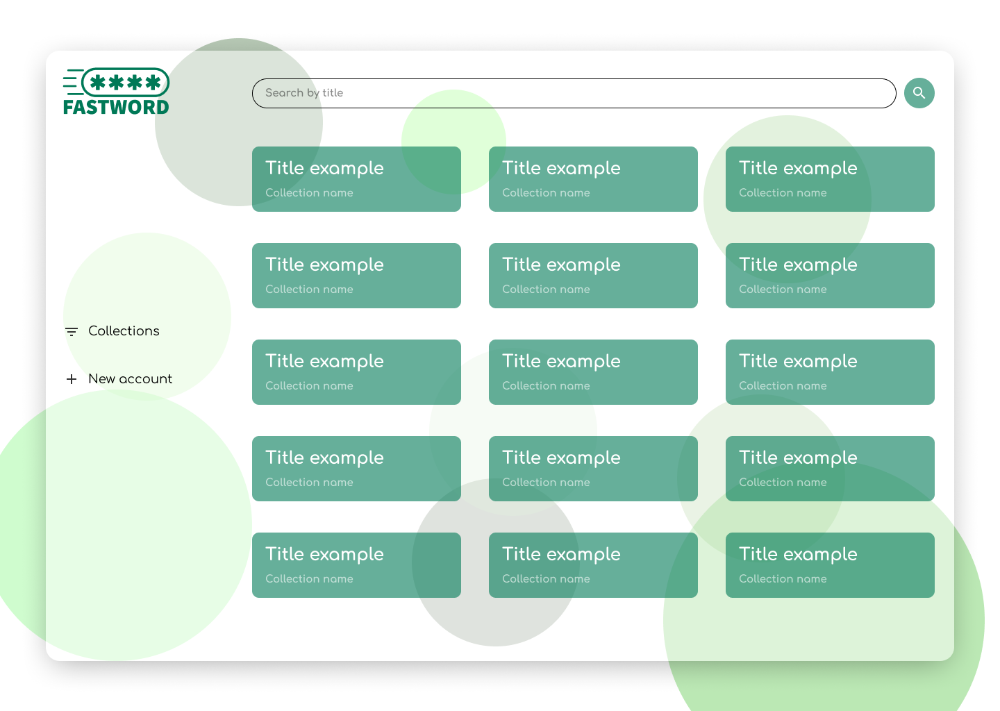

# Fastword

Preview:

Fastword es una aplicación para almacenar cuentas/contraseñas de forma ordenada y elegantemente visual. Creado para que la administración de cuentas sea eficiente, fácil y bonita.

# Indice

- [Instalación](#instlacióm)
- [Notas adicionales](#notas-adicionales)

# Instalación

**1er Paso**:

Ingresar al apartado de releases y descargar (.exe) la ultima version disponible.

LINK:
[Releases](https://github.com/SaidSuyv/fastword-releases/releases)

**2do Paso**:

Ejecutar el .exe descargado.

**NOTA IMPORTANTE: Por ser un programa en Beta, Windows detecta al programa como posible virus y proporciona confirmar si instalar o no. Seleccionar "VER MAS"(o algo así) y "Ejecutar de todas formas" para poder disfrutar del programa.**

# Notas adicionales

Si en caso encontrase algun error o desea propocionar una sugerencia dentro de la aplicación o desea participar en ella como colaborador no dude en contactarse conmigo.

Email: [sirsv.contacto@gmail.com](mailto:sirsv.contacto@gmail.com)
